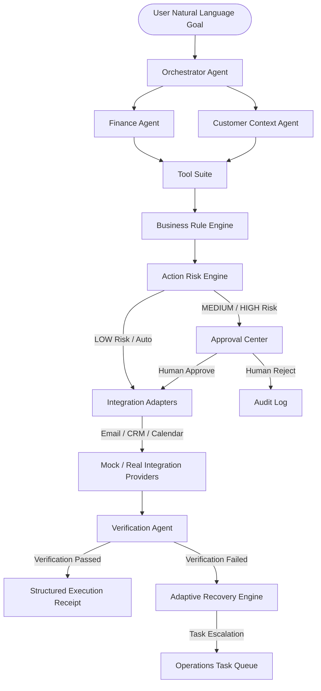

# OpsPilot AI

> **The AI Operations Agent that turns business goals into completed work.**


[](https://fastapi.tiangolo.com/)
[](https://nextjs.org/)
[](https://www.typescriptlang.org/)
[](https://www.python.org/)
[](https://www.docker.com/)

---

## 🎯 What is OpsPilot AI?

OpsPilot is **NOT a chatbot**. It is **NOT a collection of static prompts**. It is **NOT a dashboard**.

OpsPilot AI is an **agentic business execution platform** that takes a high-level natural-language business goal, reasons about required operations, dynamically formulates execution plans, applies company safety policies, evaluates risk, requests human approval when appropriate, dispatches actions across software tools, verifies side-effects, and recovers automatically from errors.

### The Core Loop:
$$\text{GOAL} \longrightarrow \text{PLAN} \longrightarrow \text{ACT} \longrightarrow \text{VERIFY} \longrightarrow \text{RECOVER / ADAPT}$$

---

## 🚀 Key Features & Architectural Capabilities

1. **Multi-Agent Orchestration**: Specialized agents (Orchestrator, Finance, Customer Context, Policy, Communication, Verification) working in concert.
2. **Action Risk Engine**: Structured classification into **LOW** (auto), **MEDIUM** (human approval required), **HIGH** (manager approval required), and **CRITICAL** (blocked).
3. **Business Rule Safeguards**: Dynamic company rule enforcement (**VIP Protection**, **Complaint Protection**, **Approval Thresholds**, **Destructive Action Blocking**).
4. **Approval Center**: Full-disclosure human-in-the-loop review showing customer details, invoice amounts, overdue days, draft emails, and system side-effects.
5. **"Why?" Explainability Panel**: Translucent decision rationale displaying decision factors, empirical evidence, rules triggered, and action justification.
6. **Visual Activity Graph**: Live execution trajectory rendering agent nodes, latency, tools used, and telemetry drawers.
7. **Empirical Verification Agent**: Validates actual side-effects (checking message IDs in email servers, reading back updated CRM fields).
8. **Adaptive Recovery Engine**: Intercepts step failures, executes retries with exponential backoff, verifies retries, and generates internal recovery tasks if retries fail.
9. **Structured Execution Receipts**: Downloadable/printable summary metrics documenting time saved, emails sent, CRM records updated, and verification status.

---

## 🏗️ Architecture & Component Flow



---

## ⚡ Hackathon Demo Workflows

### 1. Primary Overdue Invoices Workflow
**Goal:** *"Find customers whose invoices are more than 30 days overdue. Don't contact VIP customers or anyone with an open complaint. Prepare personalized reminders, show me the actions that need approval, then send the approved messages and update the CRM."*
- **Acme Technologies** ($2,840, 45d overdue) $\rightarrow$ PASS policy $\rightarrow$ MEDIUM risk $\rightarrow$ Approval requested $\rightarrow$ Approved $\rightarrow$ Email sent + CRM updated + Verified + Receipt generated.
- **Nova Retail** ($4,150, 38d overdue) $\rightarrow$ BLOCKED by `RULE-002` (Open Complaint Protection).
- **Vertex Systems** ($9,500, 60d overdue) $\rightarrow$ BLOCKED by `RULE-001` (VIP Protection).

### 2. Meeting Preparation Workflow
**Goal:** *"Prepare tomorrow's customer meetings."*
- Queries calendar events $\rightarrow$ Extracts customer context $\rightarrow$ Generates executive briefs $\rightarrow$ Assigns internal prep tasks.

### 3. Customer Follow-Up Workflow
**Goal:** *"Customer hasn't responded in 10 days. What should I do?"*
- Analyzes communication silence $\rightarrow$ Formulates follow-up strategy $\rightarrow$ Drafts personalized check-in email $\rightarrow$ Requests human review.

---

## 🛠️ Quick Start & Local Execution

### Prerequisites
- Python 3.11+
- Node.js 18+ & npm

### Running Backend (FastAPI on Port 8001)
```bash
cd backend
python -m venv venv
# Windows: venv\Scripts\activate | macOS/Linux: source venv/bin/activate
pip install -r requirements.txt
uvicorn app.main:app --host 127.0.0.1 --port 8001 --reload
```

### Running Frontend (Next.js on Port 3000)
```bash
cd frontend
npm install
npm run dev
```
Open `http://localhost:3000` in your browser.

---

## 🧪 Running Automated Test Suite

OpsPilot AI includes automated unit, policy, risk, verification, and end-to-end workflow tests using `pytest`:

```bash
# Run backend test suite from root
python -m pytest tests/
```

### Verified Test Cases:
- `test_overdue_calculation.py`: Invoice date calculation & filtering tests.
- `test_business_rules.py`: VIP & Complaint protection policy evaluations.
- `test_risk_engine.py`: LOW, MEDIUM, HIGH, CRITICAL classification logic.
- `test_verification.py`: Email send ID & CRM field mutation verifications.
- `test_api_endpoints.py`: FastAPI routes & payload schemas.
- `test_e2e_workflow.py`: End-to-end GOAL $\rightarrow$ PLAN $\rightarrow$ APPROVAL $\rightarrow$ VERIFICATION $\rightarrow$ RECEIPT pipeline.

---

## 🐳 Docker Containerization

Run the complete multi-container stack (Backend, Next.js Frontend, PostgreSQL):

```bash
docker compose up --build
```

---

## 📁 Repository Structure

```
opspilot-ai/
├── backend/
│   ├── app/
│   │   ├── agents.py           # Specialized agents & Orchestrator workflow runner
│   │   ├── adapters.py         # Integration adapters (Email, CRM, Calendar)
│   │   ├── database.py         # DataRepository storage & JSON/SQL abstraction
│   │   ├── main.py             # FastAPI router & CORS middleware
│   │   ├── models.py           # Pydantic domain models
│   │   ├── recovery.py         # Adaptive recovery & retry engine
│   │   ├── risk_engine.py      # Action risk engine
│   │   ├── rule_engine.py      # Business rule engine
│   │   └── tools.py            # Reusable agent tool suite
│   ├── Dockerfile
│   └── requirements.txt
├── frontend/
│   ├── src/
│   │   ├── app/                # Next.js App Router pages
│   │   ├── components/         # Reusable UI components (Sidebar, LivePlan, Graph, WhyPanel, Receipt)
│   │   └── lib/                # Centralized API client & TypeScript interfaces
│   ├── Dockerfile
│   └── package.json
├── data/
│   └── demo_data.json          # Realistic deterministic dataset
├── docs/                       # Architecture, Workflows, API, Development docs
├── tests/                      # Pytest automated test suite
├── docker-compose.yml
├── pytest.ini
└── README.md
```

---

## 📄 License & Credits

Built for AI Builders Hackathons by the Lead AI Agent & Engineering Team.
