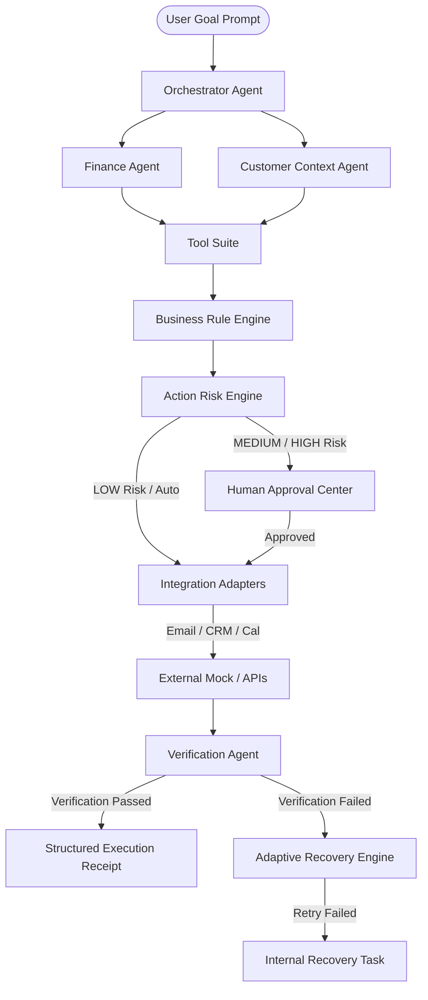

# OpsPilot AI Architecture Documentation

OpsPilot AI is an agentic business execution platform that transforms natural-language business goals into completed, verified work through an autonomous **GOAL → PLAN → ACT → VERIFY → RECOVER / ADAPT** execution loop.

## Core Architectural Layers

### 1. Agent Layer
- **Orchestrator Agent**: Interprets goals, builds dynamic plans, sequences task dependencies, and coordinates execution.
- **Finance Agent**: Identifies delinquent invoices, calculates overdue terms, and extracts financial metrics.
- **Customer Context Agent**: Retrieves customer segments, VIP status, activity history, and open complaints.
- **Policy Agent**: Evaluates company business rules via the Rule Engine.
- **Communication Agent**: Crafts personalized emails and executive meeting briefs tailored to account context.
- **Verification Agent**: Performs empirical callback checks (e.g. verifying email message IDs and CRM record updates).

### 2. Risk Engine & Business Rules
Actions are classified into 4 risk tiers:
- **LOW**: Auto-executable (internal tasks, read-only queries).
- **MEDIUM**: Human approval required (payment reminders, customer emails).
- **HIGH**: Executive approval required (refunds, contract alterations).
- **CRITICAL**: Permanently blocked (record deletions, data purges).

### 3. Adaptive Recovery System
Intercepts failures during execution, performs retries with backoff, verifies side-effects, and creates manual recovery tasks if retries fail.
